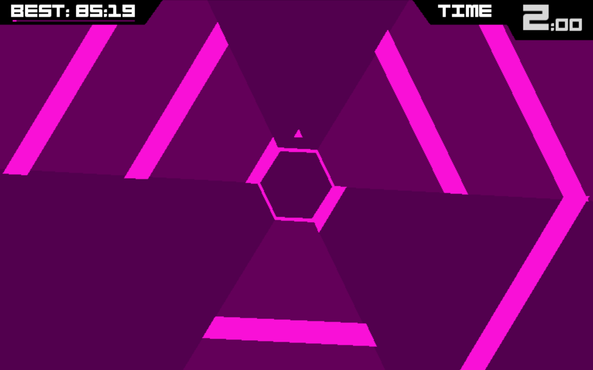
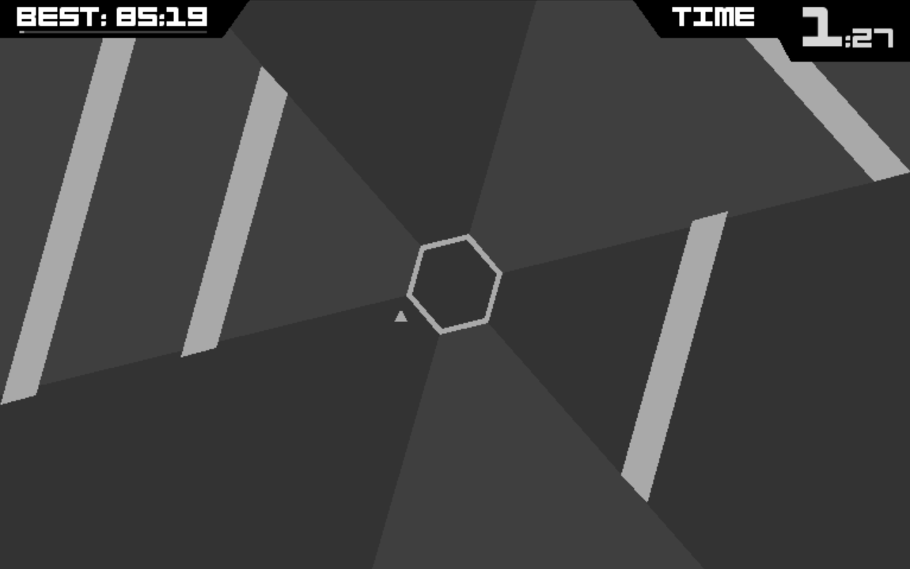
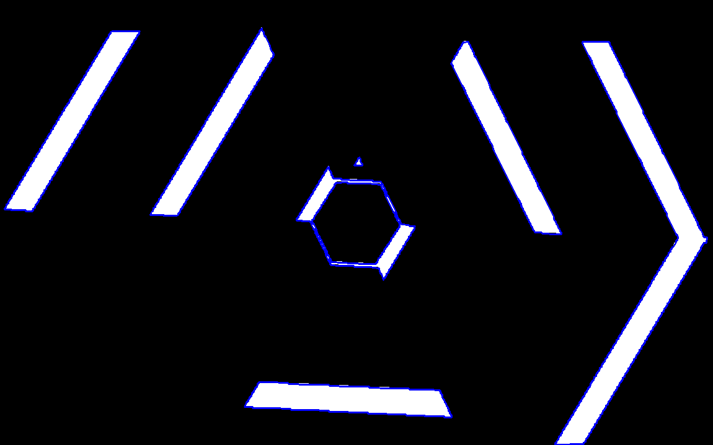
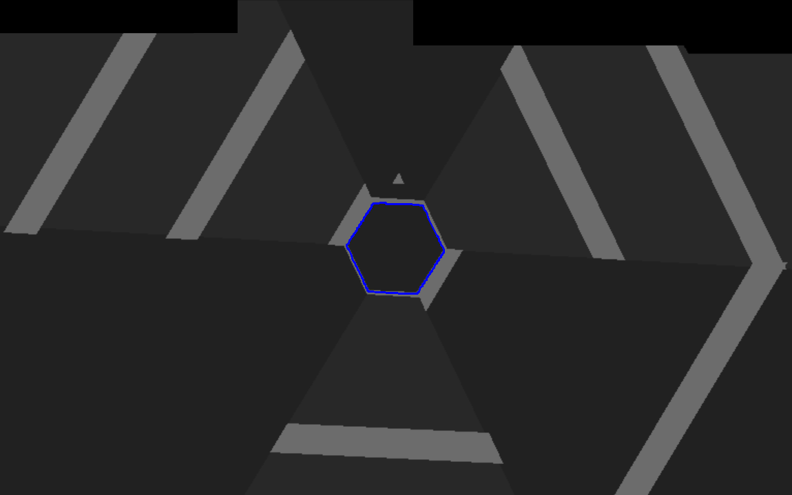
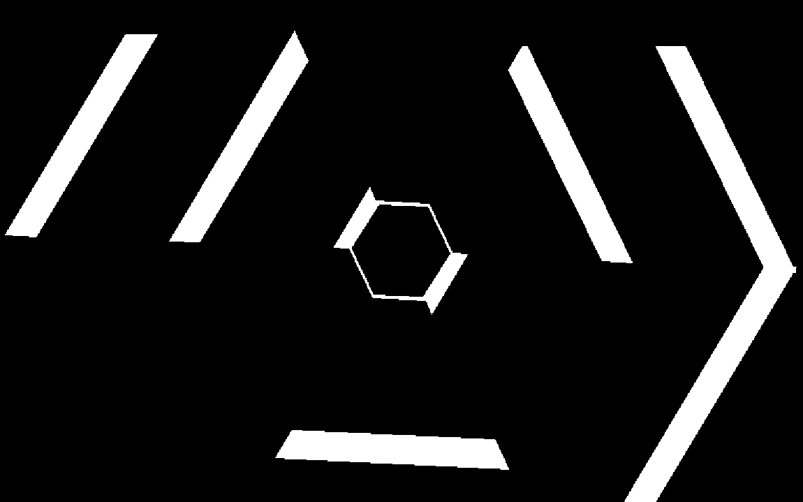
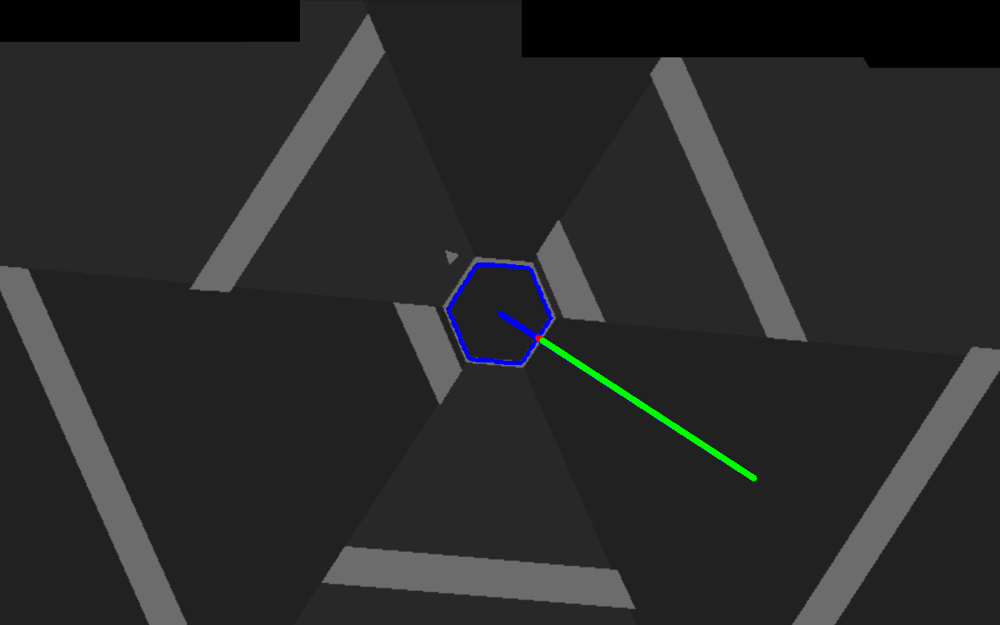
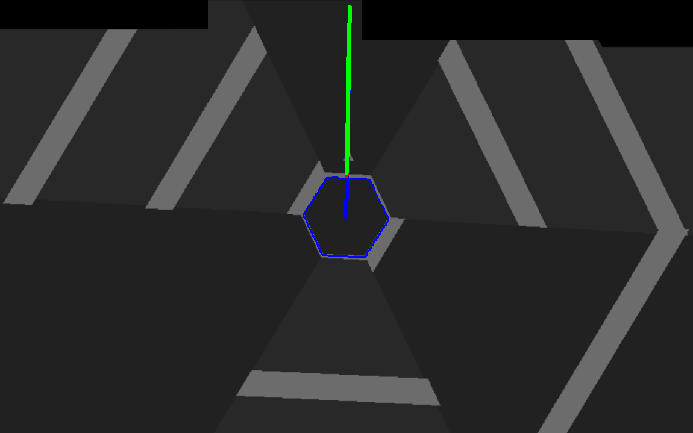

## Vorschau

Durch das Klicken auf das unterliegene Bild gelangen Sie zu einem Video wo Sie das Programm mit dem Neuronalen Netzwerk als Spieler in 
Aktion sehen können.

## Erläuterung des Programmablaufes
#### Aufnahme des Bildes
Zuerst wird das Ausgangsbild beötigt, hierzu wird ein Bild in einem Bereich des Monitors aufgenommen.

 

#### Graustufenbild
Zunächst wird es zu einem Graustufenbild transformiert, dies findet hier nach dem CCIR601 statt und nicht durch das arithmetische Mittel.

 

#### Binarisierung 
Mittels des Graustufenbildes wird nun ein Histogramm als Hilfsmittel erzeugt, um einen Schwellenwert zu bilden.
Somit kann eine Schwarz-Weiß-Segmentierung vorgenommen werden.
Hierzu wird meistens der Farbwert des Bildpunktes in der Mitte gewählt, ist dieser zu hoch wird nach einem anderen gesucht.

 

#### Finden des mittleren Hexagons
In diesem Abschnitt wird das gesamte Wissen der mathematischen Ausarbeitung angewandet.

Zunächst werden Mithilfe von morphologischen Filtern die Kanten geglättet.
Dieses Vorgehen verringert die Chance, dass der Algorithmus von Suzuki und Abe beim Finden der Konturen Zusammenhänge nicht erkennt, oder falsche Zusammenhänge identifiziert.

 

#### Finden des zentralen Hexagons
Das mittigste Hexagon ist die einzige Konstante in dem Spiel, welche stationär rotiert.
Deswegen wird nun aus allen Konturen eine Kontur gesucht, welche 6 Ecken, in Ausnahmefällen falls aufgrund von Ungenauigkeiten keine existiert auch mit 7 Ecken, und Zentral liegt, d.h. hier, dass der Median aller Punkte mittels des euklidischen Abstands Nahe am eigentlichen Mittelpunkt liegt.

Außerdem wird unter all den Konturen die genannte Bedingungen genügen die mit dem kleinsten Flächeninhalt gesucht.

Ist diese Kontur gefunden, so wird der "Spielwinkel" oder auch "Rotationswinkel" mithilfe der Eckpunkte bestimmt.
Hierzu werden die Ebene als Complexe Ebene betrachtet, wobei der Mittelpunkt des Bildes den Ursprung darstellt.
Indem die Eckpunkte in Polarkoordinaten schreibweise betrachtet werden, erhalten wir den Winkel.
 

#### Finden des Dreiecks (Spielers)
Da das Konturen finden für 3 Ecke zu unzuverlässig war in meinen Implementierungen habe ich mich für das Vergleichen mit Vorlagen entschieden.
Unter "/Images/" befinden sich 10 Bilder von dem Dreieck.
Es wird solange ein neues Bild des Dreieckes benutzt, bis eines an einer Position einem threshold genügt, also genau genug das Dreieck gefunden wurde.
Hierzu wird an nahezu jeder Bildposition mittels folgener Funktion ein Wert bestimmt.

 
Nachdem das Dreieck gefunden wurde, wird dieses noch überdeckt, um später bei der Bestimmung der Distanzen nicht weitere Ungenauigkeiten zu erzeugen.

 

 

 
