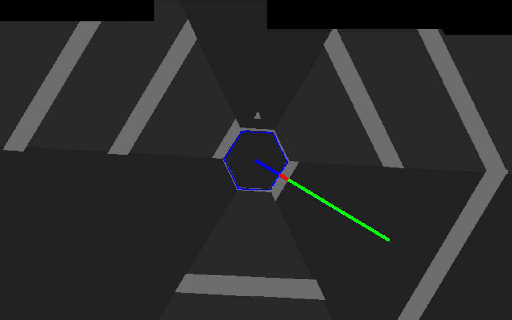

## Vorschau

Durch das Klicken auf das unterliegene Bild gelangen Sie zu einem Video wo Sie das Programm mit dem Neuronalen Netzwerk als Spieler in 
Aktion sehen können.

## Erläuterung des Programmablaufes
#### Aufnahme des Bildes
Zuerst wird das Ausgangsbild beötigt, hierzu wird ein Bild in einem Bereich des Monitors aufgenommen.

 

Zunächst wird es zu einem Graustufenbild transformiert, dies findet hier nach dem CCIR601 statt und nicht durch das arithmetische Mittel.

 

#### Binarisierung 
Mittels des Graustufenbildes wird nun ein Histogramm als Hilfsmittel erzeugt, um einen Schwellenwert zu bilden.
Somit kann eine Schwarz-Weiß-Segmentierung vorgenommen werden.
Hierzu wird meistens der Farbwert des Bildpunktes in der Mitte gewählt, ist dieser zu hoch wird nach einem anderen gesucht.

 

 

 

 

 

 
